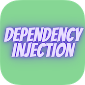

# Dependency Injection and Creating Own API from JSON using Python

  

### In software engineering, dependency injection is a technique in which an object receives other objects that it depends on, called dependencies. Typically, the receiving object is called a client and the passed-in object is called a service. The code that passes the service to the client is called the injector.

### Dependency Injection is an implementation of "Inversion of Control". Inversion of Control (IoC) says that the objects do not create other objects on which they rely to do their work; instead, they get the objects that they need from an outside source.

### https://www.raywenderlich.com/14223279-dependency-injection-tutorial-for-ios-getting-started#toc-anchor-001

